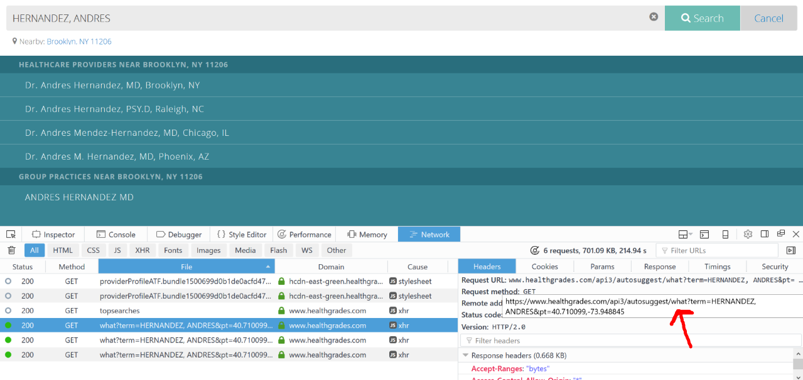
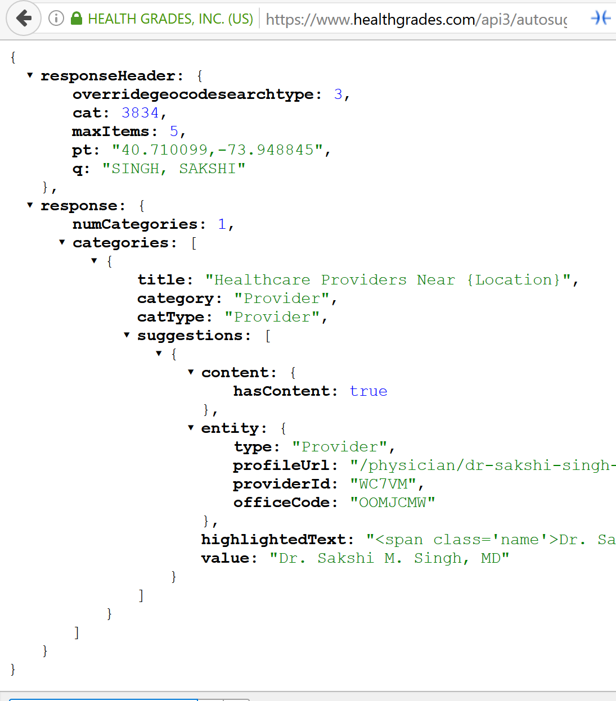
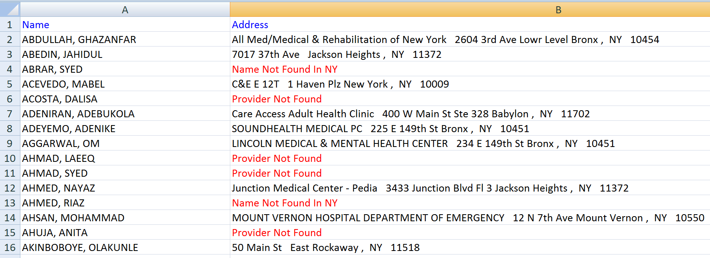

# README #

This is a simple script that takes an input Excel of physician names and outputs an Excel of practice addresses. This is accomplished by using HealthGrades.com's proprietary API, which was hidden from the public. The first challenge of this project was to find and analyze the hidden API used by HealthGrades.com for its autocomplete provider search widget. This was accomplished by using the browser's inspect tool and observing the GET requests made when modifying the autocomplete widget. The API returns a list of providers, which contains a *profile URL*. The profile URL is then downloaded and the HTML parsed for the address tag. This address is then appended to the output Excel. The screenshots below depict some of the processes described.

### Dependancies ###

* [openpyxl](https://openpyxl.readthedocs.io/en/default/)
* [BeautifulSoup4](https://www.crummy.com/software/BeautifulSoup/bs4/doc/)
* [Requests](http://docs.python-requests.org/en/master/)

### Screenshots ###

* 
* 
* 
* 